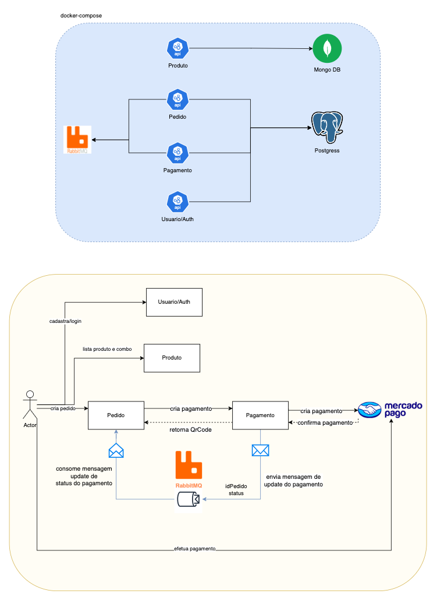

# Tech Challenge - Entrega final

Esse repositório ter como objetivo prover um Docker compose possibilitando a execução e teste do projeto no ambiente local

## Como executar o projeto

```bash
docker compose up
```


## Repositórios

### Produto API

[](https://github.com/brazalc/tech-challenge-produto/actions/workflows/codecov.yml)
[](https://codecov.io/gh/brazalc/tech-challenge-produto)

Micro serviço responsável por gerenciar os produtos de uma loja.

[Acessar link](https://github.com/brazalc/tech-challenge-produto)

## Pedido API

Micro serviço responsável por criar e gerenciar os pedidos interagindo com o Pagamento API

[Acessar link](https://github.com/edsjunior/tech-challenge-pedido)

## Pagamento API

Micro serviço responsável por gerenciar o pagamento interagindo com o Mercado Pago

[Acessar link](https://github.com/brunoalbrito/tech-challenge-pagamento)

[](https://github.com/brunoalbrito/tech-challenge-pagamento/actions/workflows/codecov.yaml)
[](https://codecov.io/gh/brunoalbrito/tech-challenge-pagamento)

## Arquitetura

O projeto adota a estratégia de **Saga Coreografada** para orquestrar as transações distribuídas. Nesse contexto, a confirmação do pagamento é realizada de forma assíncrona, utilizando a troca de mensagens para assegurar a comunicação eficaz entre os serviços de Pagamento e Pedido. Essa abordagem permite que cada serviço se comunique de maneira autônoma, garantindo consistência e resiliência na execução das operações.



## Componentes e Fluxos

### 1. Microsserviços
- **Produto**: Responsável por listar os produtos e combos disponíveis para os usuários. Ele se comunica com o banco de dados **MongoDB** para armazenar e recuperar informações de produtos.
- **Pedido**: Gerencia a criação de pedidos pelos usuários. Quando um pedido é criado, ele interage com o serviço de pagamento para iniciar o processo de pagamento.
- **Pagamento**: Gerencia o processo de pagamento, criando transações de pagamento e interagindo com o **Mercado Pago** para processar pagamentos.
- **Usuário/Auth**: Trata do cadastro e login dos usuários, garantindo que apenas usuários autenticados possam fazer pedidos.

### 2. Armazenamento de Dados
- **MongoDB**: Usado pelo serviço de **Produto** para armazenar dados relacionados aos produtos e combos.
- **Postgres**: Usado pelos serviços de **Pedido** e **Pagamento** para armazenar informações sobre os pedidos e pagamentos.

### 3. Mensageria com RabbitMQ
- O **RabbitMQ** é utilizado para orquestrar a comunicação assíncrona entre os serviços. Quando o serviço de pagamento atualiza o status de um pagamento, ele envia uma mensagem com o `idPedido` e o `status` para o RabbitMQ, que é consumida pelo serviço de pedidos para atualizar o status do pedido correspondente.

### 4. Fluxo de Processos
- **Criação de Pedido**: Um ator (usuário) inicia o processo ao criar um pedido no sistema. O serviço de pedidos então se comunica com o serviço de pagamento para criar a transação de pagamento.
- **Criação de Pagamento**: O serviço de pagamento cria a transação de pagamento e retorna um QR Code para o serviço de pedidos. Este QR Code é então enviado ao usuário para que ele possa efetuar o pagamento.
- **Confirmação de Pagamento**: Após o usuário efetuar o pagamento através do **Mercado Pago**, o serviço de pagamento confirma a transação e envia uma mensagem para o RabbitMQ, informando o status do pagamento.
- **Atualização do Pedido**: O serviço de pedidos consome a mensagem do RabbitMQ e atualiza o status do pedido com base nas informações recebidas.

## Estratégia de Saga Coreografada

- **Coreografia da Saga**: Nesta arquitetura, cada serviço é responsável por realizar suas operações de forma independente e, em caso de falha, tomar as medidas necessárias para desfazer ou compensar as ações anteriores. A comunicação entre serviços é realizada através de eventos/mensagens, sem a necessidade de um orquestrador central, o que promove maior resiliência e escalabilidade do sistema.
